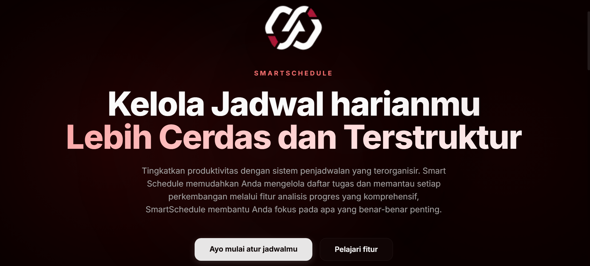
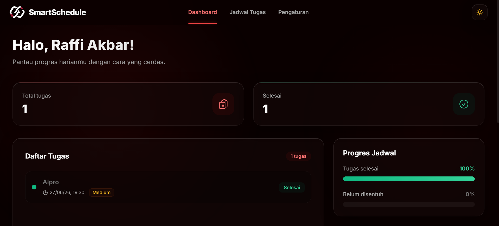

# 🚀 SmartSchedule

SmartSchedule adalah manajer tugas dan _deadline_ berbasis TypeScript. Aplikasi ini memisahkan frontend (Next.js App Router) dan backend (Express API) untuk keamanan dan skalabilitas. Pada versi terbaru ini, kami telah **mengintegrasikan Supabase Auth (Google Login)** sambil tetap mempertahankan alur kerja utama aplikasi.

> **Mentransformasi Cara Anda Mengelola Waktu.**  
> Manajer tugas dan *deadline* berbasis TypeScript dengan integrasi autentikasi modern. Dirancang dengan pemisahan *frontend* dan *backend* untuk memastikan keamanan serta skalabilitas tingkat tinggi.

[](https://opensource.org/licenses/MIT)
[](https://www.typescriptlang.org/)
[](https://nextjs.org/)
[](https://expressjs.com/)
[](https://supabase.com/)

---

## ✨ Fitur Utama

*   🔐 **Supabase Authentication**: Akses masuk instan dan aman menggunakan integrasi *login* Google sekali klik via Supabase OAuth.
*   🖥️ **Frontend Next.js Modern**: Menggunakan App Router (React 19) dengan desain antarmuka komponen yang intuitif dan responsif.
*   ⚙️ **Backend Express.js 5 Tangguh**: Menangani logika sinkronisasi data secara efisien, dilengkapi perlindungan keamanan ganda (CORS, Rate Limiter), serta komunikasi *database* yang aman.
*   📅 **Integrasi Pihak Ketiga**: Arsitektur sistem telah dirancang untuk siap mendukung sinkronisasi *event* dengan Google Calendar.

---

## 📸 Tangkapan Layar (Screenshots)

| Landing Page | Halaman Dashboard & Analitik Progres |
| :---: | :---: |
|  |  |

---

## 🛠 Instalasi dan Menjalankan Lokal

Aplikasi ini bergantung pada **Supabase (PostgreSQL)**. Untuk mempermudah proses instalasi lokal, kami telah menyediakan skrip otomatis untuk meluncurkannya menggunakan Docker Desktop di komputer Anda.

### Persyaratan Sistem
*   **Node.js**: Versi 22 atau lebih baru.
*   **Docker Desktop**: Pastikan aplikasi berjalan dan status mesin menunjukkan "Engine running".

### 1. Kloning & Install Dependensi
```bash
git clone [https://github.com/raffiakbrn10/SmaartSchedule.git](https://github.com/raffiakbrn10/SmaartSchedule.git)
cd SmaartSchedule
npm ci
```

### 2. Mengatur Environment Variables
Kami telah menyediakan kerangka file _.env_ untuk Anda. Cukup gandakan (_copy_) kerangkanya agar tersembunyi dari repositori GitHub.

```bash
# Windows (PowerShell)
Copy-Item .env.example .env.local
```

File `.env.local` Anda sudah siap digunakan karena variabel bawaannya mengarah ke port lokal (3000 dan 4000) serta _Supabase Local Development_ (127.0.0.1).

### 3. Jalankan Aplikasi
Tinggal klik 2 kali atau jalankan skrip berikut di root folder. Skrip ini akan menyalakan **Docker untuk Supabase** dan server otomatis (Next.js & Express API):

```powershell
.\start-local.bat
```
Tunggu hingga selesai mengunduh container Supabase (pada jalankan pertama kali). Web akan otomatis terbuka di `http://localhost:3000`.

---

## 🗄️ Database Setup (Untuk Supabase Cloud / Hosting Asli)

Jika Anda ingin men-deploy proyek ini (menghubungkannya ke _project_ Supabase di _cloud_ sungguhan), masukkan kode struktur *database* yang telah kami buat ke **Supabase SQL Editor**:

1. Buka Dasbor Supabase Anda.
2. Buka menu **SQL Editor**.
3. Buka file `supabase/setup_schema.sql` di proyek ini, _copy_ seluruh isinya.
4. _Paste_ lalu jalankan di Supabase.

Backend akan secara otomatis memantau login via Google dan mendaftarkannya (tersinkronisasi) ke tabel `users` PostgreSQL Anda tanpa konfigurasi pemicu (_trigger_) terpisah!

---

## ⚙️ Pengembangan Lanjutan

Jika Anda memilih untuk tidak menggunakan `start-local.bat`, berikut adalah rincian _command_ manual yang bisa digunakan:

```bash
# Memastikan Supabase menyala (perlu Docker)
npx supabase start

# Menjalankan frontend dan backend bersamaan
npm run dev

# Menjalankan Linter / Pengecekan Types
npm run lint
npm run typecheck

# Menjalankan semua unit test menggunakan Vitest
npm test
```


_(Fitur ini dinonaktifkan secara bawaan di `.env.example` untuk memudahkan pengembangan UI/Auth)._
